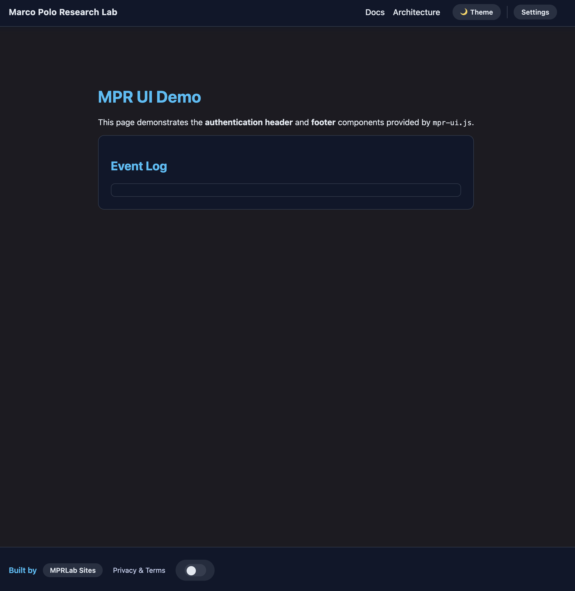

# ISSUES (Append-only section-based log)

Entries record newly discovered requests or changes, with their outcomes. No instructive content lives here. Read @NOTES.md for the process to follow when fixing issues.

Read @AGENTS.md, @ARCHITECTURE.md, @POLICY.md, @NOTES.md,  @README.md and @ISSUES.md. Start working on open issues. Work autonomously and stack up PRs.

## Features (116–199)

- [x] [MU-116] Add a size parameter to footer and header. Allow two sizes: small and normal. small size shall be 70% of the normal size and normal size is the current size. <mpr-footer size="small" — Implemented `size="small"` support for both components with scaled-down CSS overrides. Added `mpr-header--small` and `mpr-footer--small` modifier classes and updated controllers to reflect the attribute. Verified with e2e tests.

## Improvements (220–299)

## BugFixes (335–399)

- [x] [MU-336] The toogle theme switch is glitching when the footer or header use size="small": it has two circles, and when moved, a small circle is moved in the middle of the switch: @image.png  
Restored the demo footer to use the square switcher so the regression suite exercises the new UI, tightened the MU-336 size spec to ensure the switch variant toggles cleanly, and taught the MU-201 demo test to respect the active size setting.
- [x] [MU-367] Setting `size="small"` does not change the size of the footer/header. It shall make it 70% or the normal size, including its height.  
Propagated `--mpr-header-scale`/`--mpr-footer-scale` custom properties so every padding, gap, and toggle dimension shrinks to ~70%, updated Playwright specs to assert ratios instead of absolute numbers, and tuned small-mode typography + Google button scaling to match the requirement.
- [x] [MU-368] Setting `theme-switcher="toggle"` does not change the theme switcher shape. It shall switch it to the toggle switch even if we supply four themes. — Footer now prioritizes the explicit attribute/variant over legacy `themeSwitcher` config keys, and Playwright regression fixtures cover multimode + conflicting configs.
- [x] [MU-369] the toggle control should not have the outer halo. The outer areas of the toggle control should not exist.  — Flattened the footer theme toggle wrapper so it keeps the inline-flex layout without background/padding, and added Playwright coverage (MU-369) that asserts the wrapper reports transparent background, zero padding, and no shadow.
- [x] [MU-371] The toggle knob matches the track color when the switch is active, so the circle vanishes (image copy 3.png). — Introduced dedicated knob foreground variables for idle/active states, set light/dark defaults so the knob always keeps contrast, and added MU-371 Playwright coverage ensuring the knob color differs from the track after toggling.
- [x] [MU-370] The toogle control stops midway when switched -- the circle should move all the way to the end of the toggle instead.  — Reworked the travel calculation to read the knob offset/width from the computed pseudo-element, added MU-370 Playwright coverage (normal + `size="small"`) that compares the transform to the expected geometric travel, and confirmed the switch now reaches the track edge.

## Maintenance (415–499)

- [x] [MU-416] Audit mpr-ui library. Ensure we are not shipping demo-related code. Ensure that demo is shipped using the built-in capabilities. In case there are gaps => open new issues for them. We shall have no demo css or css for the elements that we dont ship (main etc). — Demo-only selectors moved to `demo/demo.css`, all demo pages/fixtures load it, and unit tests now guard that the packaged stylesheet contains component rules only.
- [x] [MU-417] Playwright suites must not use the demo pages; mirror the scenarios through dedicated fixtures only.  
Replaced demo references with a self-contained workbench fixture (`tests/e2e/fixtures/workbench.html`), updated helpers/specs to use it, and removed the lingering `demo.css` dependency from the theme toggle fixture.

## Planning
*Do not work on these, not ready*
